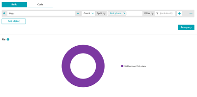
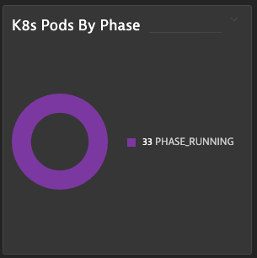

## K8s Pods Phase

### Visualize K8s Pods by Phase
1. Metric: builtin:cloud.kubernetes.workload.pods
2. Aggregation: count
3. Split by: Pod Phase
4. Visualization: Pie
5. Tile Title: K8s Pods by Phase

